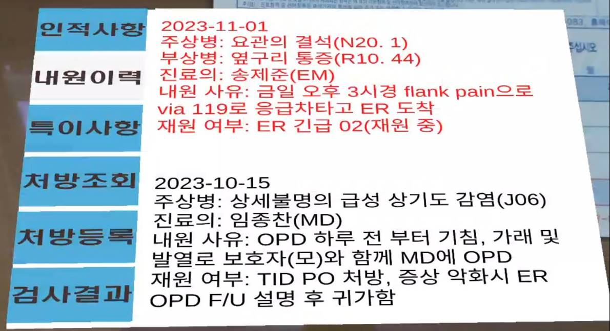

# 🩺 환자 정보 조회 애플리케이션

**설명:** 병원 근무자가 AR 디바이스를 이용해 바코드를 마커로 트래킹하여 환자 정보를 조회할 수 있는 애플리케이션입니다.

## 프로젝트 정보

- **개발 기간:** 2023-11-09 ~ 2023-12-16 
- **개발 언어:** C#
- **개발 도구:** Unity, Vuforia

## 주요 기능

- 환자 바코드를 마커로 트래킹
- 등록된 환자의 인적사항, 내원이력, 특이사항, 처방, 검사 결과를 AR을 이용해 조회
  
## 작동 기기
- 가장 이상적인 디바이스는 AR Glasses이나, 안드로이드 APK로 빌드하여 실행하였습니다.

## 스크린샷

## 프로젝트 상세 정보

더 자세한 프로젝트 정보는 아래의 PDF 파일을 참조하세요:

[프로젝트 상세 PDF 보기](report.pdf)
